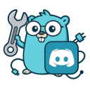

# ⚠️ Project still under construction, bugs may occur.

<p align="center" style="margin-bottom: 0px !important;">
  
</p>
<h1 align="center" style="margin-top: 0px;">godiscord</h1>

`godiscord` is a lightweight library for interacting with the Discord API in Go, inspired by [discord.js](https://discord.js.org). It provides a simple and intuitive interface to create powerful and performant Discord bots in Go.

## 📦 Installation

```bash
go get godiscord.foo.ng/lib/
```

## 🧑‍💻 Example usage

Here is a complete example of a Discord bot in Go using `godiscord`:

```go
package main

import (
	"fmt"
	"os"
	"strings"

	"godiscord.foo.ng/lib/internal/types"
	"godiscord.foo.ng/lib/pkg/classes"
	"godiscord.foo.ng/lib/pkg/enums"
)

func main() {
	token, err := os.ReadFile("token.txt")
	if err != nil {
		panic(err)
	}
	Client := classes.Client{
		Intents: []types.GatewayIntent{
			enums.GatewayIntent.Guilds,
			enums.GatewayIntent.GuildMessages,
			enums.GatewayIntent.MessageContent,
		},
	}

	Client.On("READY", func(args ...any) {
		c := args[0].(*classes.Client)
		fmt.Println(c.Username, "is ready")
	})
	Client.On("MESSAGE_CREATE", func(args ...any) {
		message := args[0].(classes.Message)
		message.Reply("Hi!")
	})
	Client.Connect(strings.TrimSpace(string(token)))
}

```

## 🛠️ Features

- **Connect to Discord** using a bot token.
- **Message handling**: send and receive messages.
- **Webhooks**, **embeds**, and more to come.

## 🧑‍💻 Contribute

- First `git clone https://github.com/AYn0nyme/godiscord`
- Then, install [minify](https://github.com/tdewolff/minify/releases)
- And you're good to **Go** 😄

## 📜 License

This project is licensed under the MIT License. See the `LICENSE` file for details.
